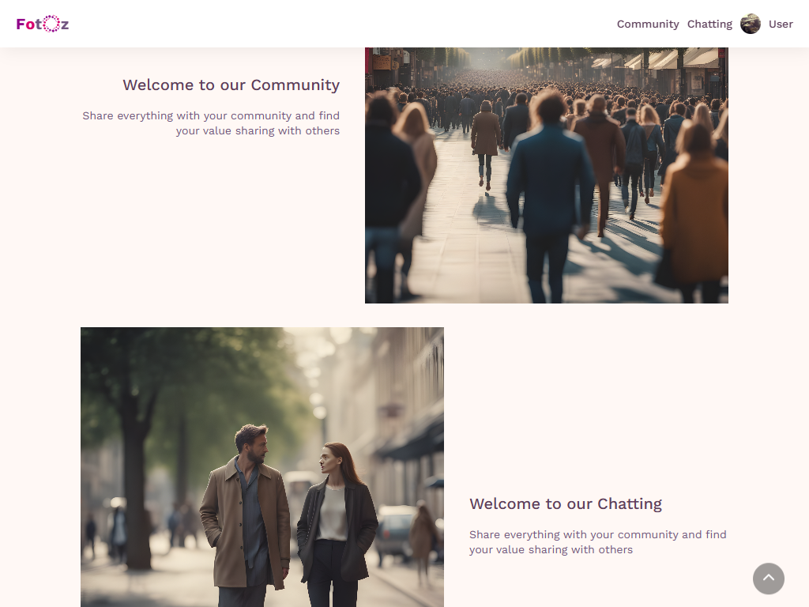

#  Photo Sharing Application

FotOz is a photo sharing application that allows users to share their favorite moments with friends and family. With FotOz, you can upload photos and share them with your loved ones. Additionally, FotOz fosters a sense of community and enables users to connect with each other through chatting and friend requests.

## Features

- Upload and share photos
- Like and comment on photos
- Follow your friends and see their latest uploads
- Explore trending photos
- Engage in community discussions through chatting
- Add friends by sending and accepting friend requests

## Technologies Used

FotOz is built using the following technologies:

- React for the frontend
- Vite for the frontend build tool
- TypeScript for type safety and better code maintainability
- Redux Toolkit for state management
- React Router for client-side routing
- Axios for HTTP requests
- Lucide for icons
- Styled Components for styling

## Getting Started

To get started with FotOz, simply sign up and start sharing your photos. You can also explore the app and discover new photos from your friends and the community.

## Contributing

We welcome contributions from the community. If you have any ideas for new features or improvements, feel free to open an issue or submit a pull request.

## License

FotOz is licensed under the ISC License. See the [LICENSE](LICENSE) file for more details.
